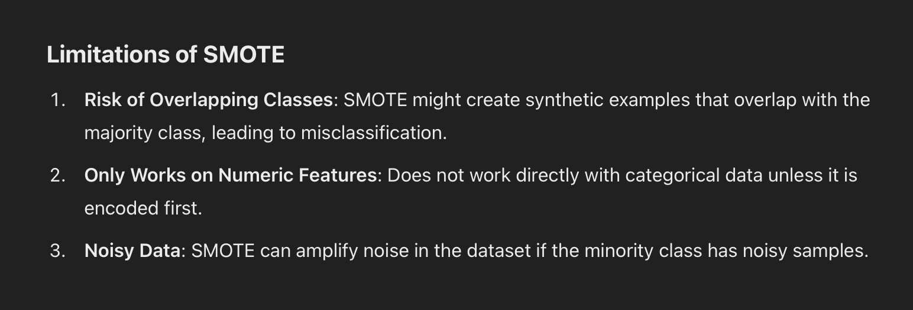
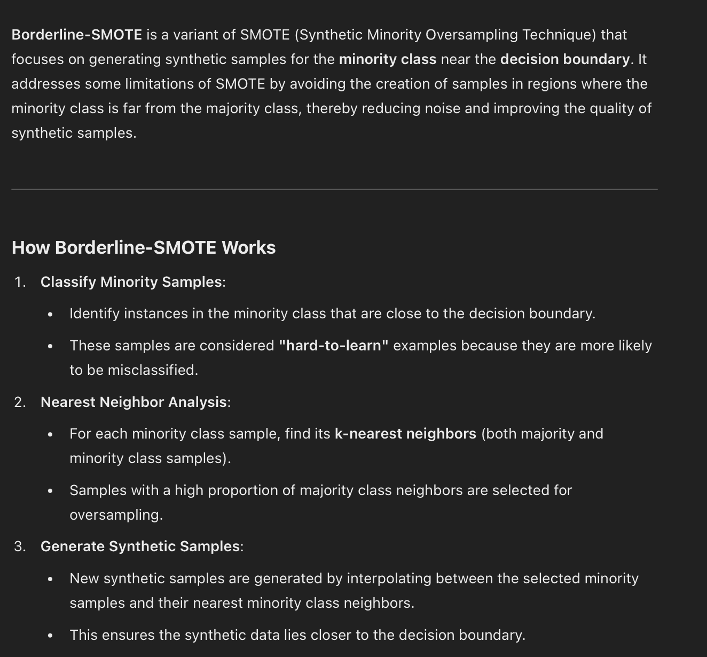

References

https://scikit-learn.org/stable/modules/linear_model.html

Oversampling:
Sometimes, datasets maybe unbalanced, for exp: In Loan dataset, the distibution of classes is as

 - Loan_Status: Y = 422
 - Loan_Status: N = 192

If model does not perform well, we must address this issue

Addressing Oversampling/Undersampling issue:
 - We use some techniques to address this issue. For exp
 1. SMOTE (Synthetic Minority Oversampling Technique)
 2. Borderline-SMOTE
 3. Random oversampling
 4. ADASYN

SMOTE

Random Oversampling

Borderline - SMOTE

ADAYSN: Adaptive synthetic sampling
